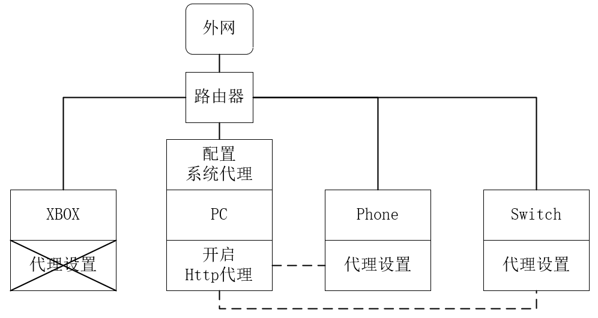
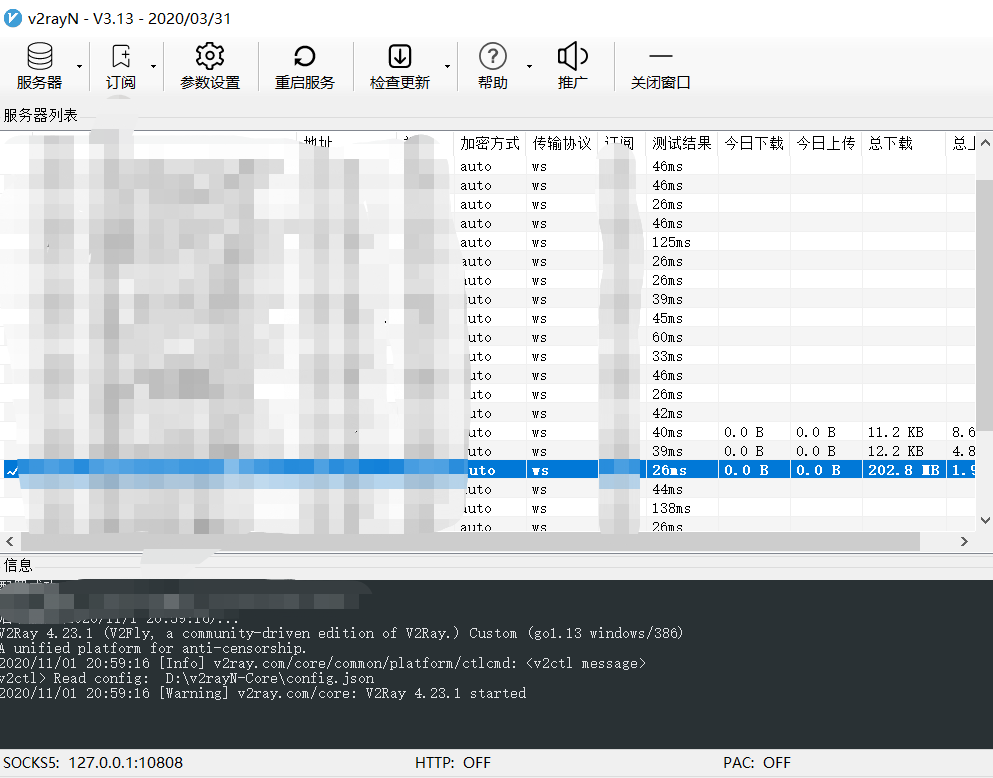
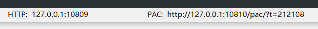
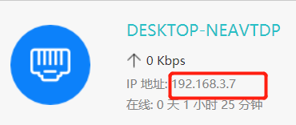
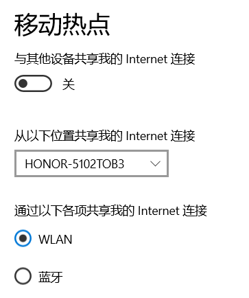
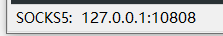
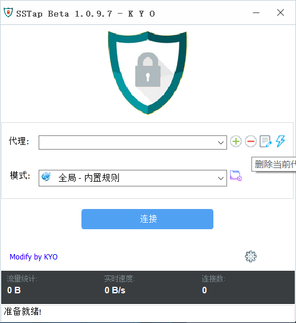
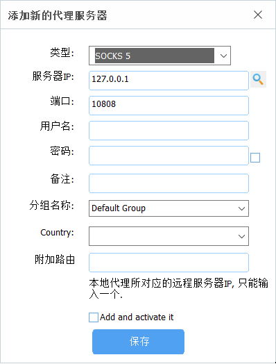
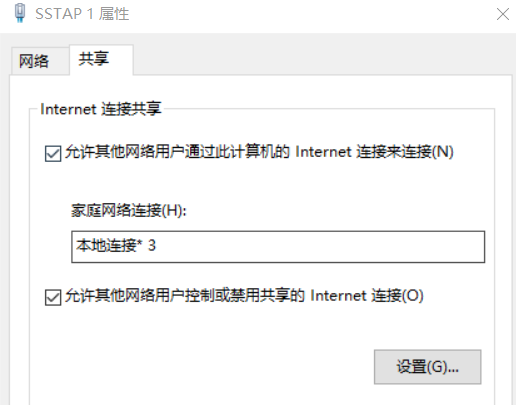

- [1. 背景](#1-背景)
- [2. 实现方法](#2-实现方法)
  - [2. 1. 路由器配置SSR](#2-1-路由器配置ssr)
  - [2. 2. Http代理](#2-2-http代理)
  - [2. 3. v2rayn+SSTAP+wifi共享](#2-3-v2raynsstapwifi共享)
- [3. 总结](#3-总结)

# 1. 背景
前一段时间为了玩地平线4，咸鱼买了二手的xbox one s。由于是港版系统，玩了一段时间发现网络情况不稳定，需要进行科学上网。

准备工具：一个v2rayN的梯子、一台带有无线网卡的PC、一台Xbox。

# 2. 实现方法
## 2. 1. 路由器配置SSR
比较简单的实现方法则是在路由器中直接配置SSR，使局域网内的所有设备均可以科学上网，这也是一个一劳永逸的方法。但由于我的路由器是荣耀路由3，并不支持刷固件来实现配置SSR。家境贫寒又不想再买一个路由器，就此作罢。
## 2. 2. Http代理



利用Http代理的方式通过PC来实现局域网内其他设备的科学上网。在三家游戏主机中，唯有Xbox不支持该种方式，但还是在此介绍一下，供Switch和PS4的玩家参考。
首先，需要一个可以ping通的v2rayN。



在设置中选择“开启PAC，并自动配置系统代理（PAC模式）”，此时在v2rayN的底行可以看见Http的端口为10809。



再查看一下PC在局域网中的地址为192.168.3.7。



这个时候我们将设备连接在局域网中，同时在switch或者手机中的网络连接中进行代理设置（由于我没有switch，用手机演示一下）。

如下图，代理服务器选择PC在局域网中的ip：192.168.3.7，端口选择v2ratN中http代理提供的端口10809。


现在在浏览器中尝试连接一下youtube，可以正常连接，设备成功科学上网。


## 2. 3. v2rayn+SSTAP+wifi共享
由于XBOX并不支持Http代理，所以需要将XBOX连接到一个已经科学上网的网络上。首先想到win10自带一个移动热点的功能，但是该网络的流量并不会走v2rayN。所以需要再创建一个虚拟网卡，先将网关连接到v2rayN，再将网卡共享给wifi。



那么，首先将v2rayN的设置改成全局模式，因为经过了虚拟网卡之后，PAC模式有可能失效。
此时，在v2rayN中检查一下SOCKS5的设置，并记录下来。



这里使用SSTAP来做为虚拟网卡

```
SSTap 全称 SOCKSTap, 是一款利用虚拟网卡技术在网络层实现的代理工具。SSTap 能在网络层拦截所有连接并转发给 HTTP,SOCKS4/5, SHADOWSOCKS(R) 代理。
```

打开SSTAP，添加转发节点。



由于V2Ray并不是SS/SSR，因此不支持直接通过SSTAP订阅。



点击连接后可以在网络设置里面看见一个名为SSTAP的适配器。


接下来将SSTAP的网络共享给移动热点，在我的电脑上是本地连接3。



此时，使用我的手机连接到电脑共享出来的wifi下，不用进行任何设置，即可访问youtube，证明连接到电脑共享出来的wifi的所有设备均可科学上网。我也用我XBOX进行了测试，地平线的在线效果也明显好于之前，未发生掉线情况。

# 3. 总结
科学上网最好的方法还是直接在路由器上做文章。如果路由器不支持的话，可以选择使用PC进行Http代理的方式让switch和PS4进行科学上网。如果恰巧你用的是不支持刷固件的路由器以及XBOX，那上文就是我在使用的方式，有些繁琐，如果拥有SS或者SSR，可以直接在SSTAP中进行订阅，就不用同时开启两个软件了。

最后，需要值得注意的是，如果你不需要科学上网了，但是需要pc开wifi的话，请将SSTAP适配器中的共享选项关掉，否则，是wifi下面的设备是不能上网的。
