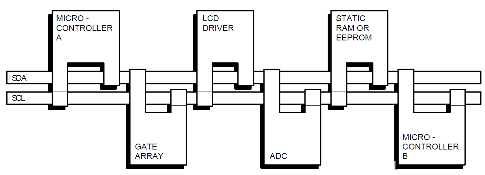
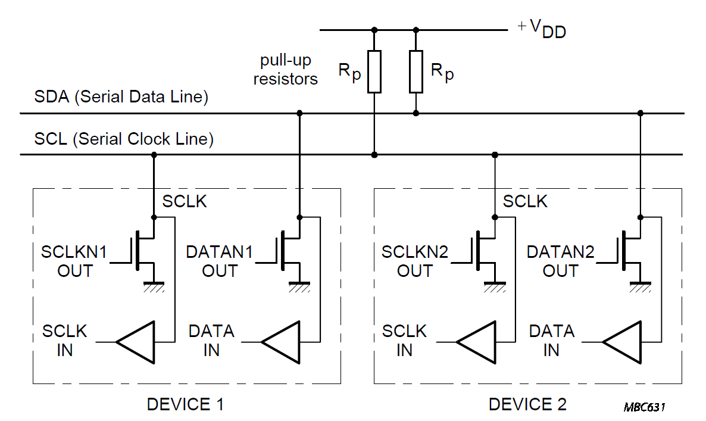
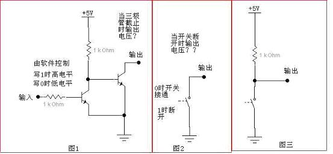

- [1. IIC协议简介](#1-iic协议简介)
- [2. IIC开漏输出与上拉电阻](#2-iic开漏输出与上拉电阻)
- [3. 数据传输](#3-数据传输)
  - [3.1 数据的有效性](#31-数据的有效性)

# 1. IIC协议简介
IIC（Inter－Integrated Circuit）总线是一种由PHILIPS公司在80年代开发的两线式串行总线，用于连接微控制器及其外围设备。它是半双工通信方式。
- IIC总线最主要的优点是其简单性和有效性。由于接口直接在组件之上，因此IIC总线占用的空间非常小，减少了电路板的空间和芯片管脚的数量，降低了互联成本。总线的长度可高达25英尺，并且能够以10Kbps的最大传输速率支持40个组件。
- IIC总线的另一个优点是，它支持多主控(multimastering)， 其中任何能够进行发送和接收的设备都可以成为主总线。一个主控能够控制信号的传输和时钟频率。当然，在任何时间点上只能有一个主控。

 
IIC串行总线一般有两根信号线，一根是双向的数据线SDA，另一根是时钟线SCL，其时钟信号是由主控器件产生。所有接到IIC总线设备上的串行数据SDA都接到总线的SDA上，各设备的时钟线SCL接到总线的SCL上。对于并联在一条总线上的每个IC都有唯一的地址。
 

# 2. IIC开漏输出与上拉电阻
SDA 和 SCL 都是双向线路都通过一个电流源或上拉电阻连接到正的电源电压。当总线空闲时，这两条线路都是高电平 连接到总线的器件输出级必须是**漏极开路或集电极开路**才能执行**线与**的功能。

在芯片中，当一个输出级为漏极/集电极开路时（开漏输出），它只能输出低电平和高阻态，低电平我们了解，那「高阻态」又是个什么东西？高阻态可理解为通过很大的电阻把输出引脚与 MCU 芯片内部隔开，近似开路的状态（电阻非常大）。这时芯片无法控制输出的电平，引脚的电平不确定，可被外部电平轻松改变。开漏输出可以简单理解为输出处接一个开关，闭合时接低电平，断开时悬空（啥也不接）。下图的中间部分电路就很好地说明这种状态。
 
正是由于开漏输出的「要么拉低要么放手」的特性，使得总线只受输出端低电平的影响（同样，设备也只能通过输出低电平来使用总线），从而实现了「线与」的功能。和「逻辑与」一样，「线与」所表达的意思是 —— **当总线上只要有一个设备输出低电平，整条总线便处于低电平状态，这时候的总线被称为占用状态。**

同时，由于IIC总线中SDA和SCL均有接上拉电阻，当输出端输出高阻态时且没有其他设备拉低总线（占用总线）时，总线被外部的上拉电阻拉高、呈现出高电平状态。——这也是为什么IIC总线中不能没有上拉电阻的原因。当没有上拉电阻时，信号新会呈现不稳定的状态，如果有某一个器件没有拉高，则扰乱通信；存在上拉电阻时，器件没有动作，电平就永远拉高。

对总线而言，上拉电阻越大，信号的上升时间就越长，通信速率就越低，反之亦然。但电阻也并不是越小越好，阻值过小的话，总线低电平时电阻上的大电流会增加电路的功耗。此外，电容也会影响信号的上升时间，于是就有了 I2C 总线总电容 400 pf 的限制，这直接关系到总线上可挂载设备的数目。

# 3. 数据传输

## 3.1 数据的有效性
